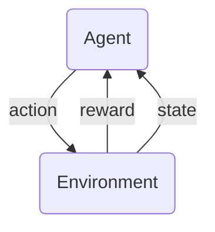

> [!Note]
> I don't know who this article is for, excepting me, but whosoever comes across this, hope you get something out of it.

**Reinforcement Learning** is made out of two parts, the *Agent* and the *Environment*, interacting with each other with each though states, actions and rewards. As an agent learns to navigate the states in an Environment in order to accomplish a particular goal, it receives in return a reward which is usually emitted by the Environment. These rewards help in guiding the agents towards the predetermined goal. The aim of the agent is to maximize the quantity of rewards it can gather from the environment and that is possible by accomplishing the assigned goal in the most optimal way. There are scenarios where this may not happen due to a badly designed environment or making the agent optimize for the wrong things. Generally, a good way to think about this setup is to think about the agent and the environment as playing a two-person turn taking game. The state always takes the first turn and provides a range of options for the kinds of actions that the agent can take. Based on this range of actions available to the agent, the agent tries to take the action that not only maximizes its immediate reward it can get from the environment but also somehow maximize the overall reward it can gain from playing the game itself. In this game setup, the environment generally does not have agency, in such a way that the agent can have. If the environment can evolve over time in order to discourage the agent, this turn taking setup simply reduces to a variation of one of von Neumann's minimax games. But for reinforcement learning, the environment can have probabilistic outputs but does not evolve over time in response to the agent. One of the simplest way to represent such a game is as a Markov Decision Processes.

## Markov Decision Processes (MDPs)

MDPs are mathematical models and can be represented by
$$
\left(\mathcal{S}, \mathcal{A}, P, R, \gamma, \rho \right)
$$ 
Each element of the tuple has been defined below:

**States** $s \in \mathcal{S}$ are the *available* positions in the MDP, there is usually a set of actions $s \mapsto \mathcal{A}(s)$ associated with any state. Any state can therefore be thought of a function $\mathcal{S} : s \to A$, such that it takes the "ID" of a state $s$ and accordingly returns a set of actions $A\subseteq \mathcal{A}$ out of which the agent chooses one based on its internal probabilistic logic. A state is almost always a part of the environment, the agent navigates through the states of an environment collecting rewards until either it runs of out turns or the goal is achieved. In order to follow through with the turn-taking metaphor, the state at turn $t$ can be represented as $s_t$.

**Actions** $a \in \mathcal{A}$ are the possible decisions that an agent can take from a particular state $s$. Actions depends on the state that the agent is currently in. 

**Transition Dynamics** $P(s^\prime \mid a, s)$ is the probability of going from state $s$ to $s^\prime$ through action $a$. The environment induces randomness through the the transition dynamics ingrained in it. Consider the action of jumping ($a$) from the roof of one building (state $s$) to the roof of another building (state $s^\prime$). It is incredibly unlikely that you can land on the other roof if the two buildings are situated far enough, therefore the resulting probability of reaching the other state in this case is fairly low. Similarly, you can easily reach the next state if the roof are very close to each other. The underlying probability of transition $s \to s^\prime$ is a function of the distance between the two roofs. This underlying function is abstracted away, and you just see a singular probability value that communicates how likely/unlikely the transition is.

**Reward Functions** are one of the most important parts of the entire setup. It is essentially the guiding hand that determines how the agent learns to adapt to and excel in the environment it has been put in. A reward function determines how many points are awarded to the agent based on which action it takes from a specific state. For a state $s_t$ and action $a_t$ at turn $t$, the reward is $r_t = R(s_t, a_t)$. 

**Discount Factor** $\gamma \in (0, 1)$ is the scalar that determines how much importance the agent affords to any reward as the number of turns increase. This gives the agent either a farsighted approach (~0.999) causing the agent to place importance on rewards further down the line or to have a more shortsighted approach (~0.95). For a discount factor of 1, the agent places equal importance on each and every reward achieved from the environment, and can be thought of having perfect 20/20 vision.

**Initial Probability** $\rho(s)$ is the probability of starting in some initial state. This is the first turn that the environment takes and randomly places the agent in one of the states with a probability of $\rho(s)$.

The above factors are mostly elements of the environment. The environment mostly dictates the dynamics of this turn-taking game, the agent just has to do its best to thrive in it. From the perspective of the agent we similarly define multiple elements that will help it adapt to the environment with each turn. The first and most important element is the internal probabilistic logic of the agent. This is represented by the policy $\pi_\theta$ which maps states to a probabilistic distribution of actions that can be taken from that particular state. There are two types of policies; the deterministic policy where a definitive action is return $a=\pi_\theta(s)$, then there is also the stochastic policy that returns a distribution of probabilities associated with each action $a_t \sim \pi_\theta(\cdot \mid s_t)$.

>[!Note]
>The notation $a_t \sim \pi_\theta (\cdot \mid s_t )$ randomly sampled from the probability distribution over actions defined by the policy $\pi_\theta$ conditioned on the current state $s_t$. The $\cdot$ is merely placeholder meaning *over all possible actions*. This requires that the current state is already known and the set of possible actions is provided. For a specific action we have $a \mapsto \pi_\theta (a \mid s_t)$ which returns the probability of the action $a$.
>
>For turn $t$, any $N$ actions are sampled from the policy to find out the expectation of the policy for that specific state:
>$$
>a_t^{(1)}, a_t^{(2)}, \dots, a_t^{(N)} \sim \pi_\theta ( \cdot \mid s_t )
>$$
>
>The resulting expectation $\mathbb{E}$ is therefore:
>$$
>\mathbb{E}_{a_t \sim \pi_\theta} [f(a_t)] \approx \frac{1}{N} \sum^N_{i=1} f\left(a^{(i)}\right)
>$$

The agent thus traces a *trajectory* through the environment based on where it first starts, which action it takes next and what reward it collects per iteration.
$$
\tau = (s_0, a_0, r_0, s_1, a_1, r_1, \dots)
$$ 
Each trajectory $\tau$ is a unique path traced through the environment resulting from the stochastic processes induced by both the agent's policy and the environment's probabilistic transition dynamics. The probability of a trajectory is as follows
$$
p_\theta (\tau) = {\color{red} \rho(s_0)} \prod^\infty_{t=0} {\color{cyan} \pi_\theta (a_t \mid s_t)} {\color{yellow} P(s_{t+1} \mid s_t, a_t)}
$$ 
Here, the policy $\pi_\theta$ has internal parameters $\theta$ that are learned in order to find the best trajectory that can maximize the reward collected from the environment. In the probability corresponding to a trajectory $p_\theta (\tau)$, only the policy $\pi_\theta$ depends on $\theta$. For a trajectory, the total amount of rewards collected can be calculated as 
$$
R(\tau) = \sum^N_{t=0} \gamma^t r_t \quad N \in [0, \infty)
$$ 
The total rewards depends, as mentioned, on the discount factor $\gamma$ and the rewards that the agent can extract out of the environment based on its decisions (actions) when interacting with the environment. The aim of any RL technique is to maximize the expectation of this discounted total reward while navigating the environment. The cost function associated with such a scenario is:
$$
J(\theta) = \mathbb{E}_{\tau \sim p_\theta} [R(\tau)]
$$ 
The calculation of the expected return can be calculated in either the discrete or continuous manner. For the simple discrete case we will have
$$
J(\theta) = \sum^N_{t=0} p_\theta (\tau) R(\tau)
$$ 
Similarly, the continuous case will be an integral
$$
J(\theta) = \int p_\theta (\tau) \, R(\tau) \, d\tau
$$ 
Taking the gradient of the expectation
$$
\nabla_\theta J(\theta) = \nabla_\theta \int p_\theta(\tau)\, R(\tau)\, d\tau
$$ 
Since $p_\theta (\tau)$ is differential by $\theta$, and the gradient function $\nabla_\theta p_\theta(\tau)$ can be dominated by some other differentiable function $g$ such that $\int g \; d\mu < \infty$, the gradient can be swapped with the integral. This arises from a combination of [Leibnitz's Theorem](https://en.wikipedia.org/wiki/Leibniz_integral_rule) for integral under partial differentiation and the [dominated convergence theorem](https://en.wikipedia.org/wiki/Dominated_convergence_theorem). The latter is ensured by the fact that any trajectory will be computed over a finite horizon $T$ and/or the rewards are discounted by a factor $\gamma < 1$ thereby diminishing the return and eventually making the series convergent and allowing the integrals and limits to commute. 
$$
\int {\color{green} \nabla_\theta\, p_\theta(\tau)}\, R(\tau)\, d\tau
$$ 
Now we concern ourselves with the green portion of the equation, which was received by pushing the gradient computed on the parameters into the integral. As can be seen above there a lot of extraneous factors in the probability which should ideally be removed in order to more simply compute the gradient of the policy $\pi_\theta(a_t \mid s_t)$ which happens to be our ultimate goal. To aid in this matter we employ a simple trick which is an consequence of the chain rule, known as the *log-derivative trick*. It is not so much a trick as rearranging the terms of log differentiation.
$$
\begin{gather*}
\nabla_\theta \log p_\theta(\tau) = \frac{\nabla_\theta\, p_\theta(\tau)}{p_\theta(\tau)}\\
\implies {\color{green} \nabla_\theta\, p_\theta(\tau)} = {\color{LimeGreen} p(\tau)\, \nabla_\theta \log p_\theta(\tau)}
\end{gather*}
$$ 
This thus leads to decomposition of the products in the trajectory probability $p_\theta(\tau)$ into a summation of probabilities and help us selectively removing all terms that are not dependent on the parameters $\theta$.
$$
\int {\color{LimeGreen} p(\tau)\, \nabla_\theta \log p_\theta(\tau)}\, R(\tau)\, d\tau
$$ 
Thus we breakdown the trajectory probability as:
$$
\log \rho(s_0) + {\color{LimeGreen} \sum^N_{t=0} \log \pi_\theta (a_t \mid s_t)} + \sum^N_{t=0} \log P(s_{t+1} \mid s_t, a_t)
$$ 
Only the portion in lime green is dependent on the $\theta$-parameters 